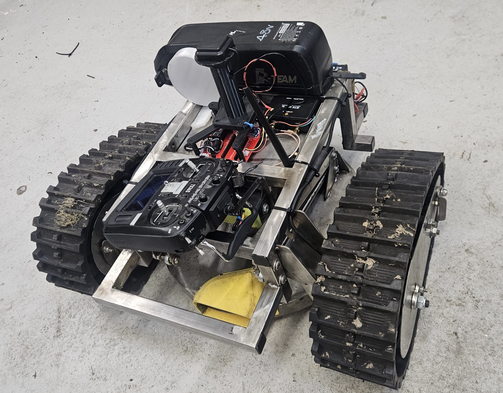
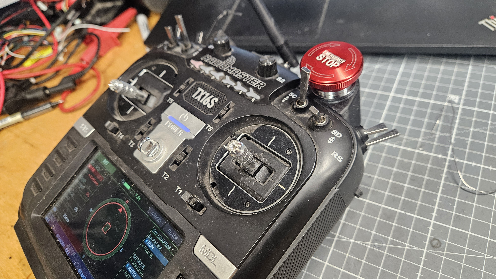

# RoboMower - Autonomous RTK GPS Lawnmower
ESP32-S3 firmware for a home-built robot mower.  RTK GPS for positioning, VESC motor controllers over CANBUS, and a RadioMaster TX16S for manual driving & telemetry.

Why build one when you can buy a robot mower off the shelf?  The commercial ones either want a wire burying around the garden, or cost about the same as a small car - and none of them will cut a meadow.  This one is built like a small tank, cuts at whatever height you like and knows where it is to a couple of centimetres.
It's also an interesting project!

My intention with publishing this is so you can design your own mechanical hardware - any brushless drive and blade motors will work, controlled with VESCs. I'm using cheap knock-off 75100 types from AliExpress which seem to work great.

I'm going to publish the cad files for my mechanics but they might not be all that useful as the mower was mostly built out of bits I had laying around. you could do a much better job buying the 'right' parts.

in the settings (Web UI) I've tried to cover as many permutations of the layout of wheels, tracks etc as possible.

▶ I'm going to make a cover for the electronics which will make it look tidier! 

## How it works

You teach it the garden by driving it around the edge with the RC transmitter (or drawing the boundary on the map in the WebUI - both work).  That recorded line is the limit the mower's steering centre is allowed to reach, and it plans a path that covers everything inside it.

The path planning borrows the idea from a 3D printer slicer.  It follows the perimeter, then spirals inward ring by ring - each ring one cut-width inside the last - until it reaches the middle, so the whole lawn is covered in one continuous path.  If the garden pinches into separate areas (a neck through to a side lawn, say), each area gets its own spiral.

Position comes from a DFRobot RTK GPS (which was the most reasonably priced I could find).  The mower only trusts the GPS when it has a centimetre-accurate **RTK-Fixed** solution; the rest of the time it dead-reckons on wheel odometry.  That matters because gardens have trees, and RTK drops to a less accurate "Float" solution (sometimes a metre or two out) under the canopy - so rather than chase a bad fix, it coasts on odometry until a clean Fixed comes back.  Heading comes from a magnetometer-based 9-axis IMU (a Bosch BNO055): its on-chip fusion gives a tilt-compensated absolute compass heading, with a small offset trimmed from the GPS travel direction on straight RTK-Fixed runs.  The wheel-odometry scale (ticks per metre) and track width are self-calibrated against the GPS, again only on Fixed.

In case you're interested, you can find small tracks on eBay & AliExpress, intended for ATV's.  I used a pair of Bafung geared e-bike front wheel motors with the freewheel clutch welded up so they will drive in reverse to drive the tracks.  They produce bags of torque at low current and are super robust!

If it gets stuck in long wet grass, it raises the cutting deck, has another go, and progressively lowers it again.  If the blade is working too hard, it finishes the strip at maximum height and re-traces lower.  If it hits something (detected by the IMU - no bumpers), it notes the position as an obstacle and routes around it next time.

## Hardware

* ESP32-S3 DevKitC-1, the **N16R8** version (16MB Flash / 8MB PSRAM).  Be careful here - if you flash this firmware onto a generic S3 board with different memory, you'll likely brick it and need the Espressif Flash Download Tool or JTAG to recover it.  Ask me how I know.
* DFRobot GNSS-RTK board (Quectel LC29H) + NTRIP corrections.  Gives 1-2cm accuracy when it has an RTK Fixed solution.
* Bosch BNO055 9-axis IMU - on-chip sensor fusion gives an absolute heading; also used for tilt safety and collision detection.
* 3x VESC motor controllers on CANBUS at 250 kbit/s.  Mine are a mixed bag: two older HW4.x for the wheels (ID 1 & 2) and a HW6 for the blade (ID 3).  The older ones work fine, but make sure "Send CAN Status" is enabled in VESC Tool on ALL of them - the firmware needs the eRPM feedback, and the old boards default to silent.
* Blade motor is from a Gtech cordless mower (CLM021) - cheap, light and surprisingly tough.  The VESC limits it to 2800 RPM, so the firmware just asks for full speed and lets the VESC's current limit do the soft start.
* 13S battery, RadioMaster TX16S + ER8 receiver (ELRS), a linear actuator for cut height, and a PILZ safety relay as a proper hardware E-stop in the 48V line.  The ESP32 runs on a supercap backup so it doesn't lose its position when the PILZ fires or you swap the battery.

## Controls & monitoring

Day to day you don't need a laptop for anything.  The TX16S runs a Lua widget (in the repository) showing state, battery, blade load, GPS quality and a compass (with a line pointing at the next waypoint) - and it beeps at you when the mower wants attention.  CH4 selects Manual / Auto / Nudge, CH5 records the perimeter, CH6 arms the blade, CH7 pauses.

A few things make it pleasant to live with.  **Nudge** (CH4 up) hands the sticks back to you mid-mow without ending the run - shove it off an obstacle or correct a drift, flick back to Auto and it carries on exactly where it was.  Pausing and flicking back to Auto does the same as long as the mower hasn't been moved; if you carried it somewhere, it starts the cycle again.  And rather than swing a wide arc to reach a point behind it (which could wander over the boundary), it simply reverses to it.

*Everything at a glance on the transmitter - state, compass, GPS quality and blade load.  The big red button is exactly what it looks like.*

There's also a WebUI - a single HTML file that connects over Bluetooth from a phone (Chrome on Android).  That gives you a live map, perimeter editing, config settings and a diagnostics page with the raw VESC data.  If something misbehaves, the System Log on the dashboard tells you what the mower decided and why - copy & paste it if you want help.

When the battery gets low it warns you on the transmitter and the phone, then leaves the decision to you.  The VESCs look after themselves as the voltage drops, so there's no need for the firmware to panic on your behalf.

# Important Note:
If you use a different VESC for the blade, check which bytes of the CAN STATUS_5 message you're reading.  I had a bug where the firmware read the first two bytes (which are actually the tachometer) as the battery voltage.  It decoded as -0.1V, the firmware decided the battery was flat, and quietly refused to start the blade - while the transmitter cheerfully displayed "Armed & Running".  That one took a while to find.  The voltage is in bytes 4-5.
#

## Setting it up

1. Arduino IDE 2.x, board "ESP32S3 Dev Module", Partition Scheme "Huge APP (3MB No OTA)", PSRAM "OPI PSRAM".  Libraries: Adafruit BNO055 (+ Adafruit Unified Sensor) and FastLED.
2. In VESC Tool: set CAN IDs 1 (left), 2 (right), 3 (blade), baud 250 kbit/s, enable CAN status messages on all three.  Drive motors in current control, blade in speed control with a 2800 RPM limit.
3. Wiring, calibration and the full operating procedure are in manual.md.  The CRSF telemetry format (if you want to build your own display) is in telemetry.md.
4. Drive the perimeter, press Auto, and watch it go.

Thanks to Benjamin Vedder for the VESC project - which makes projects like this possible, and to the OpenMower project for convincing me RTK GPS was the right approach.

I did consider just building the OpenMower project - but it's intended for a specific off the shelf mower rather than something mostly home built.  It would have taken extensive re-writing, so I decided to go it alone.  I also preferred to use an ESP32 rather than an RPi just because it boots near instantly.  I wasn't sure the whole thing would fit in an ESP32, but here it is!

Feel free to copy, share, change - whatever you like!

NOTE:
This is a DIY, experimental project.  It is not a turn-key product, and getting something wrong can put a heavy machine with a spinning blade somewhere you don't want it!  If you are not confident with electronics, software and/or mechanics - please walk away unless you're not fond of your fingers & toes!!!

I do not accept responsibility if it mows your flower beds, your neighbour's fence, the cat - or you!
